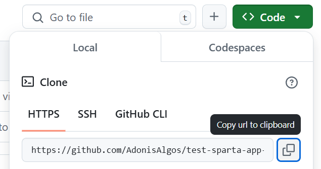
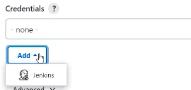
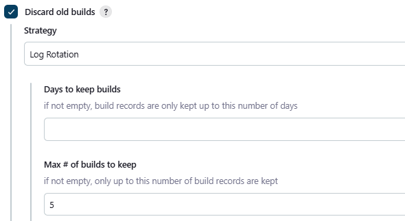
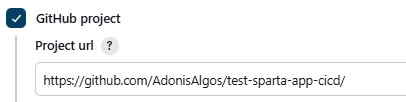
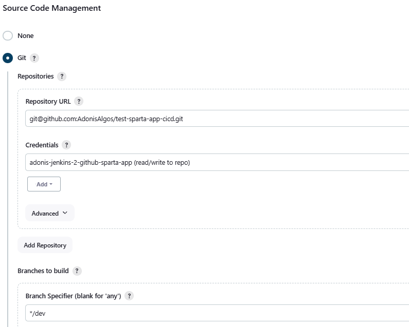
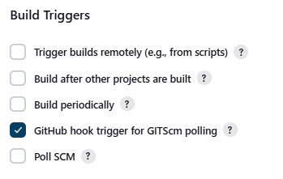
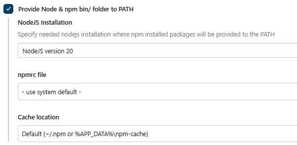

# Learning CI/CD

- [Learning CI/CD](#learning-cicd)
  - [What is CI? Benefits?](#what-is-ci-benefits)
  - [What is CD? Benefits?](#what-is-cd-benefits)
  - [Difference between CD and CDE](#difference-between-cd-and-cde)
  - [What is Jenkins?](#what-is-jenkins)
    - [Why Use Jenkins?](#why-use-jenkins)
    - [Benefits of Jenkins](#benefits-of-jenkins)
    - [Disadvantages of Jenkins](#disadvantages-of-jenkins)
    - [Stages of Jenkins](#stages-of-jenkins)
    - [What alternatives are there for Jenkins](#what-alternatives-are-there-for-jenkins)
  - [Why build a pipeline? Business value?](#why-build-a-pipeline-business-value)
  - [Diagram of CI/CD](#diagram-of-cicd)
  - [Jenkins](#jenkins)
    - [Planning a 3 job CI/CD Pipeline](#planning-a-3-job-cicd-pipeline)
    - [Creating a Pipeline via Jenkins UI](#creating-a-pipeline-via-jenkins-ui)
      - [Allowing Jenkins to Read/Write from a GitHub repo.](#allowing-jenkins-to-readwrite-from-a-github-repo)
      - [Connecting multiple jobs to run sequencially.](#connecting-multiple-jobs-to-run-sequencially)
    - [Creating Job 1 in Jenkins](#creating-job-1-in-jenkins)
    - [Creating Job 2 in Jenkins](#creating-job-2-in-jenkins)
    - [Creating Job 3 in Jenkins](#creating-job-3-in-jenkins)

## What is CI? Benefits?

**CI (Continuous Integration)**: A development practice where developers integrate code into a shared repository frequently.

**Benefits**: Early bug detection, reduced integration issues, improved collaboration, and faster feedback loops.

## What is CD? Benefits?

**CD (Continuous Deployment/Delivery)**: Automates deployment processes to ensure that code changes are automatically prepared or deployed to production.

**Benefits**: Accelerated release cycles, reduced manual intervention, consistent deployment processes, and faster time-to-market.

## Difference between CD and CDE

**CD (Continuous Delivery)**: Prepares code for release but may require manual approval for deployment.

**CDE (Continuous Deployment)**: Automates deployment to production without manual steps.

## What is Jenkins?

**Jenkins**: An open-source automation tool for CI/CD pipelines, supporting plugins to build, test, and deploy applications.

### Why Use Jenkins?

* **Automation of CI/CD**: Jenkins automates repetitive tasks in the CI/CD process, reducing the chance of human error and speeding up software delivery.
* **Open-source with Community Support**: Jenkins is free to use and has a large, active community, making it easier to find resources, tutorials, and plugins.
* **Flexible and Extensible**: With hundreds of plugins, Jenkins can be customized to fit a wide range of project needs and integrate with various tools, such as Git, Maven, Docker, and Kubernetes.
* **Scalability**: Jenkins can scale to accommodate large, complex projects by distributing workloads across multiple nodes.


### Benefits of Jenkins

* **Automation**: Saves time by automating the entire CI/CD pipeline, from code commit to deployment.
* **Flexibility through Plugin**s: Jenkins has over 1,800 plugins, allowing integration with almost any tool in the development and deployment process.
* **Scalability**: Supports distributed builds across multiple machines, ideal for large projects.
* **Continuous Monitoring**: Allows for constant feedback on code quality and deployment status, enabling faster and more reliable releases.

### Disadvantages of Jenkins

* **Complexity**: Setting up and managing Jenkins can be complex, especially for teams new to CI/CD.

* **Plugin Management Overhead**: With many plugins available, ensuring compatibility and managing plugin updates can be time-consuming.

* **Resource-Intensive**: Jenkins can be resource-heavy, especially when running large numbers of builds or supporting complex pipelines.

### Stages of Jenkins

**Stages**: Code, Build, Test, Deploy, Post-deploy actions/feedback

### What alternatives are there for Jenkins

**Alternatives**: GitLab CI/CD, CircleCI, Travis CI, GitHub Actions, Bamboo.

## Why build a pipeline? Business value?

**Pipeline Benefits**: Streamlines development, ensures quality, reduces errors, enables faster and reliable software delivery, and aligns with agile business needs.

## Diagram of CI/CD

**Diagram Elements**: Code → Build → Test → Release → Deploy → Monitor.

*Understand SDLC workflow: plan, design, develop, deploy*

**SDLC Workflow**: Sequential phases where requirements are planned, solutions designed, software developed, and then deployed to production, ensuring systematic development.

## Jenkins

### Planning a 3 job CI/CD Pipeline


### Creating a Pipeline via Jenkins UI

1. Click on **New Item** to create a new job.
2. Create the Jenkins project
   * Fill in the name under **Enter an item name**.
   * Select **Freestyle project**.
4. Confirm by clicking **OK**.
5. Now should be redirected to the **General** page of your project.
   * Add a description to explain the project.
   * Enable Discard old builds and configure the **Max # of builds to keep** value to 5.
     *This determines when, if ever, build records for this project should be discarded. Build records include the console output, archived artifacts, and any other metadata related to a particular build.*
   * Scroll down to **Build Steps** and select **Execute shell**.
     *This will provide a bash shell where you can enter commands for the Jenkins project to run.*
6. Lastly **Save** the configurations.
7. You can click **Configure** to re-configure the job settings.
8. To run the project click on **Build Now**.
9. Wait for the job to be executed.
   *You can have a general overview of your Pipeline by navigating to the Dashboard. The build will be present at the bottom left of the left sidebar.*
10. To get more detail on the executed job click the **job hyperlink** *(should be in the middle of the screen)*. At the bottom left there will be a log with date and time displayed for the project just ran. Click the date or instance **link**.
11. Select the **Console Output** tab to display the output of the bash shell ran on an **EC2 instance** that was spun up to execute the Jenkins job.

#### Allowing Jenkins to Read/Write from a GitHub repo.

***Given that:***
* *An SSH key pair is generated locally and stored in the ~/.ssh directory.*
* *Public key is stored in the GitHub repo by navigating to **Settings** > **Deploy Keys** clicking **Add deploy Key** pasting the public key contents in the text area and enabling **Allow write access***

**Configuring Jenkins Project to Read/Write from a GitHub repo.**

1. Navigate to the **Configure** tab of the Jenkins job.
2. Enable **GitHub project**.
   * A dropdown form will be displayed where the repos URL should be entered. *Navigate to GitHub and copy the repo URL eg. https://github.com/AdonisAlgos/test-sparta-app-cicd* <br> 
  
   * Paste the URL into the **Project url** input field.
3. Scroll down to the **Source Code Management** section.
   * Select **Git**.
   * In the dropdown form enter the SSH Repository URL copied from the same place as previously from GitHub. *Navigate to GitHub and copy the repo URL eg. git@github.com:AdonisAlgos/test-sparta-app-cicd*
   * In the **Credentials** subsection either select the key stored previously, ***which should be the private key content that connects to the public key stored in your GitHub repo***, or select **Add** to store it.

     1. If selected **Add**, click Jenkins from the dropdown.<br><br> 
     2. Within the pop-up modal/window set **Kind** to **SSH Username with private key**.
     3. Configure the **ID** as the same private key file name.
     4. Add a brief **Description** for the purpose of the key.
     5. Set Username as, similarly to the **ID**, the same private key file name.
     6. Toggle the **Private Key** tick box as **Enter directly**. **Make sure your in a safe environment, print the private key to the screen and paste it in the appeared text area.**
     7. Select **Add** to store the key.
     8. Lastly once directed select the newly stored key.
   * Scroll a little further down to **Branches to build** and in the **Branch Specifier** text input enter the branch that should trigger the pipeline when content is pushed to *(eg. main or dev)*.

#### Connecting multiple jobs to run sequencially.

1. Navigate to the **Configure** tab of the first job that will be executed within the sequence.
2. Scroll down to **Post build actions** > select **Build other projects**.
3. Choose your next project (can add multiple).
4. Select **Trigger only if build is stable** to sequencially run all jobs if the previous is successfull.
5. Click **Save**.
6. Then **Build now**.
7. in the **Console Output** you should be able to view a jobs output and a reference to the next or previous job.

### Creating Job 1 in Jenkins

***Given that:***

*A **Freestyle Project** has been initialised.*<br>
*The **SSH GitHub private key** for the repository that is tracking the application has safely been uploaded to Jenkins.*

1. Navigate to the **Configure** tab of the first job.
2. Enable **Discard old builds** and set the max number to **5**. <br> 
3. Enable **GitHub project** and enter the HTTPS URL of the GitHub repo.<br>
4. At **Source Code Management** enable **Git** and provide the **SSH GitHub URL** of the repo and match it with the previously uploaded **private key** that unlocks the padlock set on the online repo.<br>
5. Enable **GitHub hook trigger for GITScm polling** in **Build Triggers** to listen when a push is commited to the online repo.<br>
6. Enable **Provide Node & npm bin/ folder to PATH** select the according information to match the application.<br>
7. Lastly in the **Build Steps** section select **Execute Shell** from the **Add build step** dropdown box and enter the below commands to complete Job 1.  
 
```bash
cd app
npm install
npm test
```

### Creating Job 2 in Jenkins

1. Follow **ALL** steps from Job 1 besides the **GitHub hook trigger for polling** in the Build Triggers section.<br><br>
*The listener is configured in the first job which is triggered when a push happens on the dev branch. On the contrary Job 2 is triggered after job one's successful completion.*

2. **Not Recomended**: In step 7 where we generate an **Executable Shell** we can define the following commands to achieve the merge.

```bash
git switch main
git merge origin/dev
git push origin main
```
3. **Recomended**: Skip step 7 and do not generate a **Shell**. Instead utilise the **Git Publisher** plugin in the **Post-build Actions** section.
   * Eneble **Push Only if Build Succeeds**.
   * Enable **Merge Results**.
   * Define the **Branch to push** input field to as the "**main**" and the **Target remote name** as "**origin**". <br>
   *When configurations can be done through pluggins it is a recomended practice to utilise them.*
4. Click **Save**.
5. Lastly, Job 1 needs to be re-configured to execute Job 2 after completion. Navigate to the **Configure** tab of the first job and scroll down to the **Post build actions** > select **Build other projects**.
6. Choose **Job 2**.
7. Select **Trigger only if build is stable** to sequencially run all jobs if the previous is successfull.
8. Click **Save**.

### Creating Job 3 in Jenkins

*Given that:*

*A **Freestyle Project** has been initialised.*<br>
*The **SSH AWS private key** to SSH into the EC2 Instance running the app has safely been uploaded to Jenkins.*<br>
*The EC2 instance is running the application (not through user data)*

1. Follow **ALL** steps from Job 1 besides the **GitHub hook trigger for polling** in the **Build Triggers** section.
2. An additional step is to enable the **SSH Agent** within the **Build Environment** section and select the **SSH key** that allows the Jenkins server to connect to the **EC2 Instance** running the app.
3. Within the executable Bash shell add the following commands:

```bash
# Copy the 'app' folder to the EC2 instance's home directory using rsync over SSH.
# -a: archive mode, -v: verbose, -z: compression, -e: specify SSH with no host key checking.
rsync -avz -e "ssh -o StrictHostKeyChecking=no" app ubuntu@34.246.180.38:~

# SSH into the EC2 instance and execute the commands in the block below.
ssh -o StrictHostKeyChecking=no ubuntu@34.246.180.38 <<EOF

   # Stop all running PM2 processes.
   pm2 stop all

   # Navigate to the 'app' folder.
   cd app

   # Install app dependencies.
   npm install

   # Start the app using PM2.
   pm2 start app.js

EOF
```

4. Lastly, **Save** the configured third job and similarly to previous steps, ensure that **job 2 triggers job 3 upon successful completion**.
